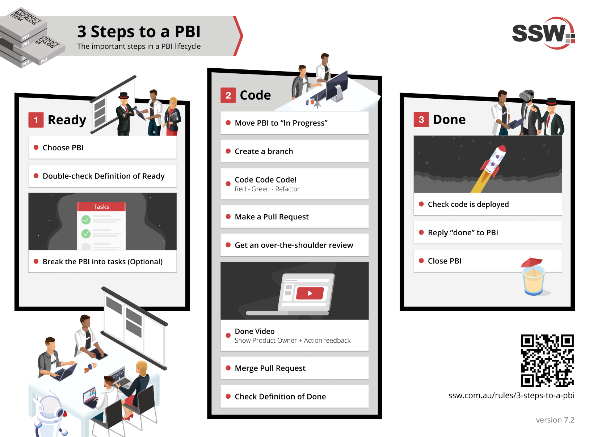

# 3 Steps to a PBI

This directory contains the visual representation of the '3 Steps to a PBI'.

## Image

### Description

The image illustrates the three essential steps to defining a Product Backlog Item (PBI) in Agile project management. This is crucial for enhancing clarity and ensuring alignment within the team.
